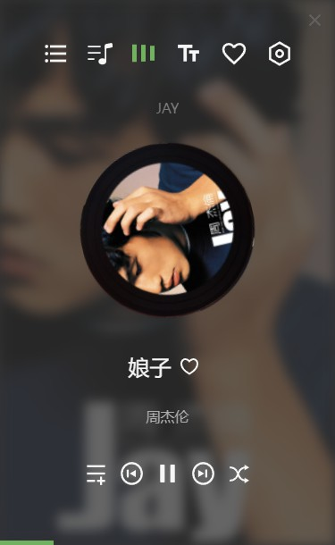

# horen-lite
 horen player lite edition

## Screen Shoots


## To-do's
- [ ] lyric show
- [ ] playing list
- [ ] albums viewer: hover to show
- [x] rotate cover
- [ ] favorites
- [ ] more setting
- [x] switch between play modes
- [ ] add current track to ...
- [ ] roll the title when it is too long
- [ ] ~~read i18n resources from json file~~
- [ ] hide the player to the tray when click the minimize button

## Develop

```bash
# clone the project
git clone https://github.com/horenjs/horen-lite.git
# entry the dir
cd horen-lite
# install dependencies
npm i
# run the dev
npm run start
# if you want to package
npm run build
npm run package
```

## License

MIT License